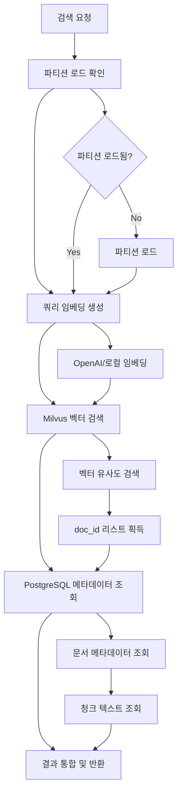

# 🔍 검색 API 명세서

## 📋 개요

RAG 시스템에서 벡터 유사도 검색을 수행하는 API입니다. 자연어 쿼리를 벡터로 변환하여 Milvus에서 유사한 문서를 찾고, PostgreSQL에서 메타데이터를 조회하여 통합된 결과를 반환합니다.

- **검색 엔드포인트**: `/search/query` - 벡터 유사도 검색
- **지원 기능**: 계정별/봇별 검색, 메타데이터 필터링, 성능 모니터링

## 🏗️ 아키텍처

### 검색 프로세스
```
1. 쿼리 텍스트 → 2. 임베딩 변환 → 3. Milvus 벡터 검색 → 4. PostgreSQL 메타데이터 조회 → 5. 결과 통합
```

### 데이터 흐름
```
📝 사용자 쿼리
    ↓
🧠 임베딩 서비스 (OpenAI/로컬)
    ↓
🔍 Milvus 벡터 검색 (파티션별)
    ↓
📊 PostgreSQL 메타데이터 조회
    ↓
📋 통합 결과 반환
```

---

## 🔗 API 엔드포인트

### 🔍 벡터 유사도 검색

#### **엔드포인트**
```
POST /search/query
```

#### **요청 스키마**
```json
{
  "account_name": "string",           // 계정명 (필수)
  "chat_bot_id": "string",            // 챗봇 ID (UUID, 필수)
  "query_text": "string",             // 검색 쿼리 (필수)
  "limit": 5,                         // 반환할 결과 수 (기본값: 5)
  "filter_expr": "string"             // 메타데이터 필터 표현식, data/insert 할때 넣은 메타데이터 (선택)
}
```

#### **필드 설명**

| 필드 | 타입 | 필수 | 설명 | 예시 |
|------|------|------|------|------|
| `account_name` | string | ✅ | 계정명 (컬렉션 선택용) | `"chatty"` |
| `chat_bot_id` | UUID | ✅ | 챗봇 ID (파티션 선택용) | `"550e8400-e29b-41d4-a716-446655440000"` |
| `query_text` | string | ✅ | 검색할 자연어 쿼리 | `"인공지능 학습 방법"` |
| `limit` | integer | ❌ | 반환할 결과 수 (기본값: 5) | `10` |
| `filter_expr` | string | ❌ | Milvus 필터 표현식 | `'metadata["file_type"] == "pdf"'` |

#### **응답 스키마**
```json
{
  "status": "success",
  "vector_search_time_ms": 28.15,
  "postgres_query_time_ms": 12.34,
  "total_time_ms": 45.67,
  "results": [
    {
      "doc_id": 123,
      "chunk_index": 2,
      "score": 0.85,
      "chunk_text": "인공지능 학습을 위한 주요 방법들...",
      "document": {
        "title": "AI 학습 가이드",
        "content_name": "ai_guide.pdf",
        "metadata": {
          "file_type": "pdf",
          "author": "김개발",
          "tags": ["AI", "학습", "가이드"]
        }
      }
    }
  ]
}
```

#### **응답 필드 설명**

| 필드 | 타입 | 설명 |
|------|------|------|
| `status` | string | 요청 처리 상태 (`"success"` 또는 `"error"`) |
| `vector_search_time_ms` | float | 벡터 검색 소요 시간 (밀리초) |
| `postgres_query_time_ms` | float | PostgreSQL 조회 소요 시간 (밀리초) |
| `total_time_ms` | float | 전체 처리 소요 시간 (밀리초) |
| `results` | array | 검색 결과 배열 |

#### **검색 결과 아이템**

| 필드 | 타입 | 설명 |
|------|------|------|
| `doc_id` | integer | 문서 ID |
| `chunk_index` | integer | 청크 순서 (0부터 시작) |
| `score` | float | 유사도 점수 (0.0 ~ 1.0, 높을수록 유사) |
| `chunk_text` | string | 청크 텍스트 내용 |
| `document.title` | string | 문서 제목 |
| `document.content_name` | string | 문서 파일명 |
| `document.metadata` | object | 문서 메타데이터 (JSON) |

---

## 📝 사용 예시

### 1️⃣ 기본 검색

#### **요청**
```bash
curl -X POST "http://localhost:8000/search/query" \
  -H "Content-Type: application/json" \
  -d '{
    "account_name": "chatty",
    "chat_bot_id": "550e8400-e29b-41d4-a716-446655440000",
    "query_text": "인공지능 학습 방법",
    "limit": 5
  }'
```

#### **응답**
```json
{
  "status": "success",
  "vector_search_time_ms": 28.15,
  "postgres_query_time_ms": 12.34,
  "total_time_ms": 45.67,
  "results": [
    {
      "doc_id": 123,
      "chunk_index": 2,
      "score": 0.85,
      "chunk_text": "인공지능 학습을 위한 주요 방법들은 다음과 같습니다...",
      "document": {
        "title": "AI 학습 가이드",
        "content_name": "ai_guide.pdf",
        "metadata": {
          "file_type": "pdf",
          "author": "김개발"
        }
      }
    }
  ]
}
```

### 2️⃣ 메타데이터 필터링 검색

#### **요청**
```bash
curl -X POST "http://localhost:8000/search/query" \
  -H "Content-Type: application/json" \
  -d '{
    "account_name": "chatty",
    "chat_bot_id": "550e8400-e29b-41d4-a716-446655440000",
    "query_text": "머신러닝 알고리즘",
    "limit": 10,
    "filter_expr": "metadata[\"file_type\"] == \"pdf\""
  }'
```

### 3️⃣ 복합 필터링 검색

#### **요청**
```bash
curl -X POST "http://localhost:8000/search/query" \
  -H "Content-Type: application/json" \
  -d '{
    "account_name": "chatty",
    "chat_bot_id": "550e8400-e29b-41d4-a716-446655440000",
    "query_text": "딥러닝 모델",
    "limit": 5,
    "filter_expr": "metadata[\"tags\"] like \"%AI%\" and metadata[\"file_type\"] == \"pdf\""
  }'
```

---

## 🔧 고급 기능

### 📊 성능 모니터링

검색 API는 상세한 성능 메트릭을 제공합니다:

- **`vector_search_time_ms`**: 임베딩 생성 + Milvus 검색 시간
- **`postgres_query_time_ms`**: PostgreSQL 메타데이터 조회 시간
- **`total_time_ms`**: 전체 요청 처리 시간

### 🎯 필터 표현식

Milvus 필터 표현식을 사용하여 메타데이터 기반 검색이 가능합니다:

#### **기본 연산자**
```python
# 문자열 비교
metadata["file_type"] == "pdf"
metadata["author"] != "unknown"

# 숫자 비교
metadata["page_count"] > 10
metadata["file_size"] <= 1024000

# 배열 포함 검사
metadata["tags"] like "%AI%"
metadata["category"] in ["tech", "science"]

# 논리 연산자
metadata["file_type"] == "pdf" and metadata["page_count"] > 5
metadata["author"] == "김개발" or metadata["author"] == "이개발"
```

#### **복합 필터 예시**
```python
# PDF 파일이면서 AI 관련 태그가 있는 문서
metadata["file_type"] == "pdf" and metadata["tags"] like "%AI%"

# 특정 기간에 생성된 문서
metadata["created_date"] >= "2024-01-01" and metadata["created_date"] <= "2024-12-31"

# 페이지 수가 10 이상이면서 특정 저자의 문서
metadata["page_count"] >= 10 and metadata["author"] == "김개발"
```

### 🏷️ 파티션 관리

- **자동 파티션 로드**: 검색 시 해당 봇의 파티션이 자동으로 메모리에 로드됩니다
- **파티션명 규칙**: `bot_{chat_bot_id_without_dashes}` (예: `bot_550e8400e29b41d4a716446655440000`)
- **성능 최적화**: 파티션별 검색으로 빠른 응답 시간 보장

---

## ⚠️ 주의사항

### 🔒 필수 사전 조건

1. **계정 설정**: `account_name`에 해당하는 컬렉션이 존재해야 합니다
2. **봇 등록**: `chat_bot_id`에 해당하는 봇이 등록되어 있어야 합니다
3. **데이터 존재**: 해당 봇에 검색할 문서가 삽입되어 있어야 합니다
4. **파티션 로드**: 첫 검색 시 파티션 로드로 인해 약간의 지연이 발생할 수 있습니다

### 🚨 오류 처리

#### **일반적인 오류 코드**

| HTTP 코드 | 오류 메시지 | 원인 | 해결 방법 |
|-----------|-------------|------|-----------|
| `400` | `Invalid request format` | 요청 형식 오류 | JSON 스키마 확인 |
| `404` | `Collection not found` | 컬렉션 미존재 | 계정명 확인 |
| `404` | `Bot not found` | 봇 미등록 | 봇 등록 확인 |
| `500` | `Query embedding failed` | 임베딩 서비스 오류 | 임베딩 서비스 상태 확인 |
| `500` | `Vector search failed` | Milvus 연결 오류 | Milvus 서비스 상태 확인 |
| `500` | `Metadata retrieval failed` | PostgreSQL 연결 오류 | PostgreSQL 서비스 상태 확인 |

#### **오류 응답 예시**
```json
{
  "detail": "Search failed: cannot call Connection.fetch(): connection has been released back to the pool"
}
```

### 📈 성능 최적화 팁

1. **적절한 limit 설정**: 필요한 만큼만 결과를 요청하세요
2. **필터 활용**: 메타데이터 필터로 불필요한 검색 범위를 줄이세요
3. **파티션 활용**: 봇별 파티션으로 검색 성능을 최적화하세요
4. **캐싱 고려**: 자주 사용되는 쿼리는 클라이언트에서 캐싱하세요

---

## 🔄 워크플로우

### 검색 프로세스 상세



### 성능 특성

- **첫 검색**: 파티션 로드로 인해 1-2초 지연 가능
- **후속 검색**: 일반적으로 100-500ms 내 응답
- **대용량 검색**: limit을 적절히 조절하여 성능 유지

---

## 📚 관련 문서

- [📄 문서 삽입 API](./01.%20INSERT_DOCUMENT.md) - 문서 삽입 방법
- [📋 스키마 사용법](./02.%20SCHEMA_USAGE.md) - 데이터베이스 스키마 관리
- [🏗️ 시스템 아키텍처](./RAG_Milvus_API_Design.md) - 전체 시스템 설계

---

## 🆘 문제 해결

### 자주 발생하는 문제

#### **Q: 검색 결과가 없어요**
A: 다음을 확인해보세요:
- 봇이 올바르게 등록되었는지
- 해당 봇에 문서가 삽입되었는지
- 쿼리 텍스트가 너무 구체적이지 않은지

#### **Q: 검색이 너무 느려요**
A: 다음을 시도해보세요:
- limit 값을 줄여보세요
- 메타데이터 필터를 사용해보세요
- 파티션이 이미 로드된 상태인지 확인해보세요

#### **Q: 필터가 작동하지 않아요**
A: 다음을 확인해보세요:
- 필터 표현식 문법이 올바른지
- 메타데이터 키가 존재하는지
- 데이터 타입이 일치하는지

---

*📅 최종 업데이트: 2025-01-26*
*📝 버전: 1.0.0*
