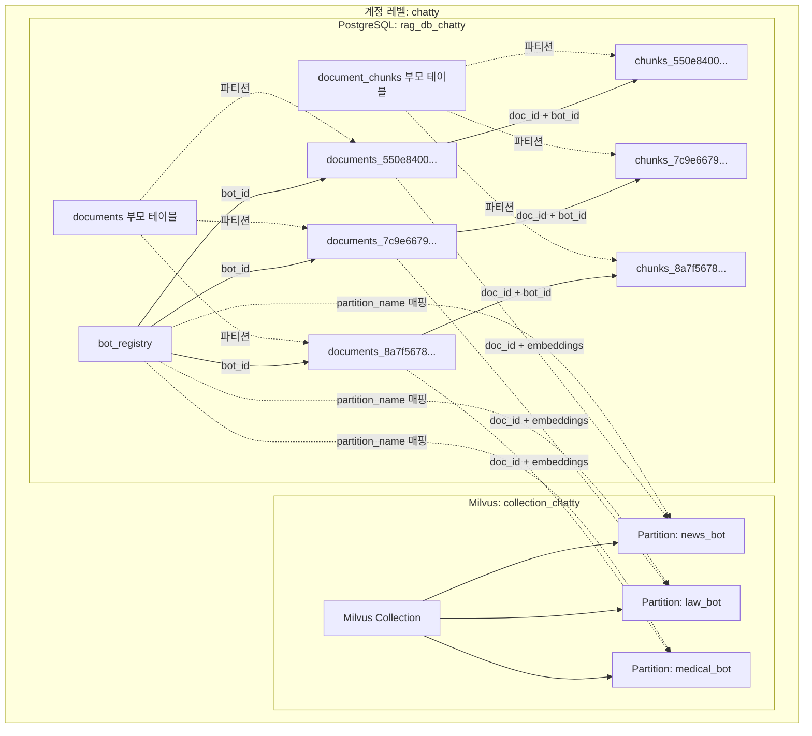
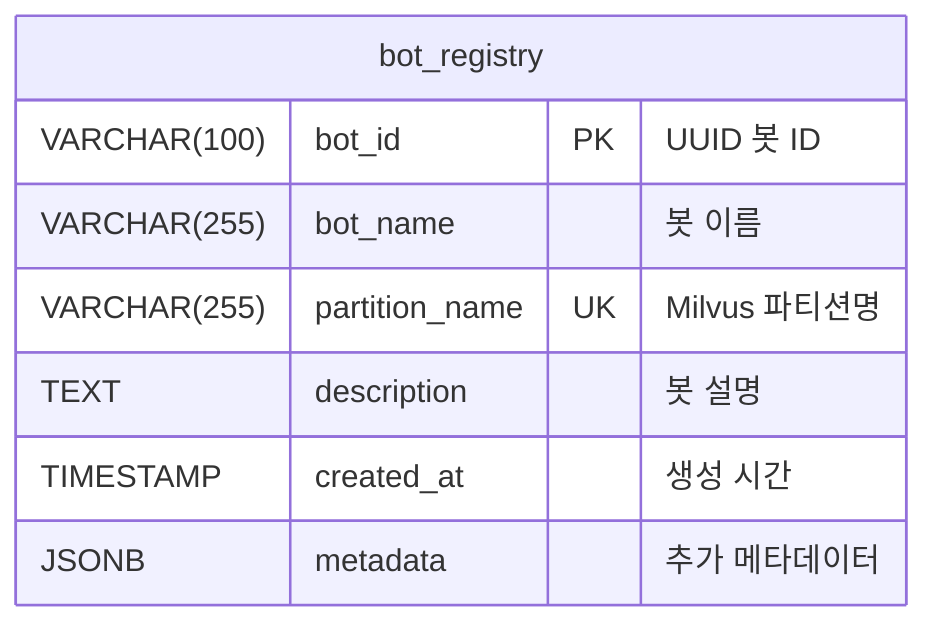
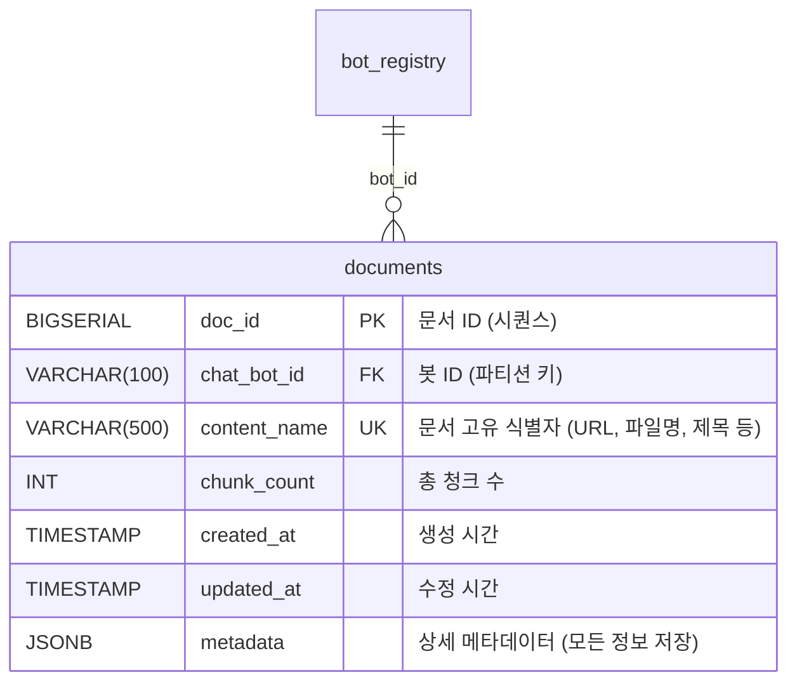
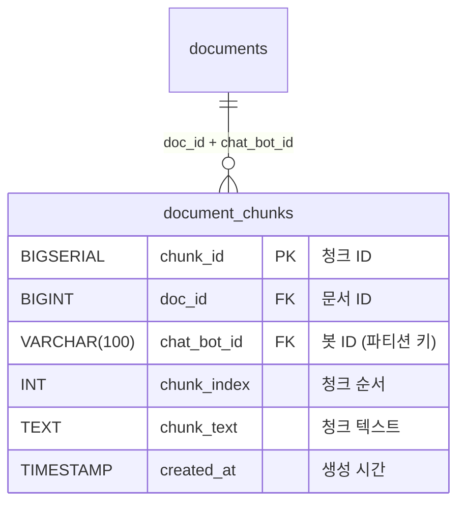
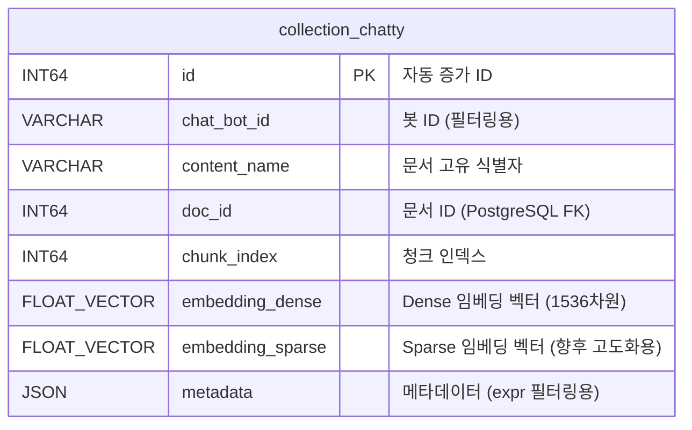
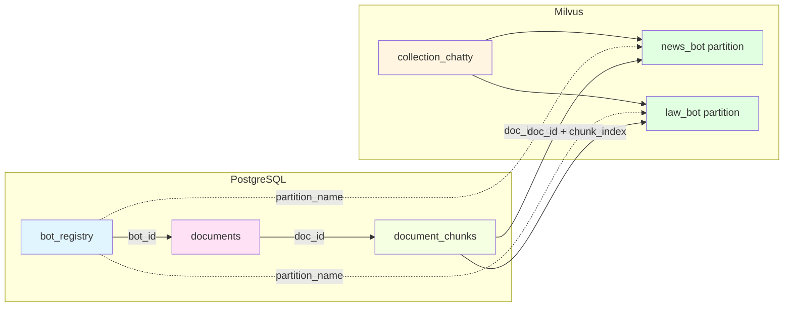
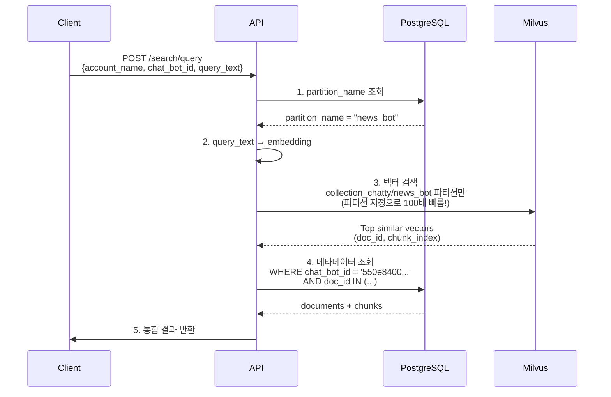
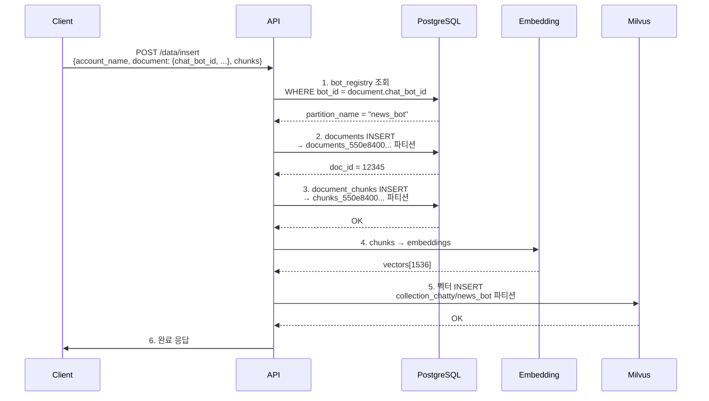

# 🗄️ ERD: Milvus + PostgreSQL

## 📊 전체 시스템 아키텍처



## 🗂️ PostgreSQL 테이블 구조

### 1. bot_registry (봇 레지스트리)



**예시 데이터:**
| bot_id | bot_name | partition_name | created_at |
|--------|----------|----------------|------------|
| 550e8400-... | 뉴스봇 | news_bot | 2024-01-01 |
| 7c9e6679-... | 법률봇 | law_bot | 2024-01-02 |
| 8a7f5678-... | 의료봇 | medical_bot | 2024-01-03 |

---

### 2. documents (문서 테이블 - 파티셔닝)



**파티션 구조:**
```sql
-- 부모 테이블
CREATE TABLE documents (...) PARTITION BY LIST (chat_bot_id);

-- 파티션들
CREATE TABLE documents_550e8400e29b41d4a716446655440000
    PARTITION OF documents
    FOR VALUES IN ('550e8400-e29b-41d4-a716-446655440000');

CREATE TABLE documents_7c9e6679742540de944be07fc1f90ae7
    PARTITION OF documents
    FOR VALUES IN ('7c9e6679-7425-40de-944b-e07fc1f90ae7');
```

---

### 3. document_chunks (청크 테이블 - 파티셔닝)



**파티션 구조:**
```sql
-- 부모 테이블
CREATE TABLE document_chunks (...) PARTITION BY LIST (chat_bot_id);

-- 파티션들
CREATE TABLE document_chunks_550e8400e29b41d4a716446655440000
    PARTITION OF document_chunks
    FOR VALUES IN ('550e8400-e29b-41d4-a716-446655440000');
```

---

## 🎯 Milvus 컬렉션 스키마

### collection_chatty 스키마



**필드 설명:**
| 필드 | 타입 | 설명 | 용도 |
|------|------|------|------|
| `id` | INT64 (PK) | 자동 증가 ID | Milvus 내부 관리 |
| `chat_bot_id` | VARCHAR | 봇 UUID | 필터링 (expr) |
| `content_name` | VARCHAR | 문서 고유 식별자 | 문서 식별 및 삭제 |
| `doc_id` | INT64 | 문서 ID | PostgreSQL 조인 |
| `chunk_index` | INT64 | 청크 순서 | 정렬 |
| `embedding_dense` | FLOAT_VECTOR(1536) | Dense 임베딩 벡터 | 의미적 유사도 검색 ⭐ |
| `embedding_sparse` | FLOAT_VECTOR(변동) | Sparse 임베딩 벡터 | 향후 하이브리드 검색 🔍 |
| `metadata` | JSON | 메타데이터 | 필터링 (content_type, tags 등) |

**파티션 구조:**
```
collection_chatty/
├── bot_550e8400e29b41d4a716446655440000 (뉴스봇 벡터)
├── bot_7c9e6679742540de944be07fc1f90ae7 (법률봇 벡터)
└── bot_8a7f5678823451efb345567890abcdef (의료봇 벡터)
```

---

## 🔗 PostgreSQL ↔ Milvus 연결



### 매핑 관계

| PostgreSQL | Milvus | 연결 키 |
|-----------|--------|---------|
| `bot_registry.bot_id` | `collection_chatty[partition].chat_bot_id` | 봇 식별 |
| `bot_registry.partition_name` | `collection_chatty[partition_name]` | 파티션 매핑 ⭐ |
| `documents.content_name` | `collection_chatty.content_name` | 문서 고유 식별자 |
| `documents.doc_id` | `collection_chatty.doc_id` | 문서 연결 |
| `document_chunks.chunk_index` | `collection_chatty.chunk_index` | 청크 순서 |
| `document_chunks.chunk_text` | `collection_chatty.embedding_dense` | 임베딩 변환 |

---

## 🔍 검색 흐름



---

## 📥 삽입 흐름



---

## 🎯 파티션 프루닝 효과

### PostgreSQL 파티션 프루닝

```sql
-- 쿼리
SELECT * FROM documents 
WHERE chat_bot_id = '550e8400-e29b-41d4-a716-446655440000'
  AND title LIKE '%AI%';

-- 실행 계획
Seq Scan on documents_550e8400e29b41d4a716446655440000
  Filter: (title ~~ '%AI%')
  
-- ✅ documents_550e8400... 파티션만 스캔 (300만 행)
-- ❌ 다른 99개 파티션 무시 (2억9700만 행)
-- 결과: 100배 빠름! ⚡
```

### Milvus 파티션 검색

```python
# bot_registry에서 partition_name 조회
partition_name = "bot_봇ID"  # chat_bot_id → partition_name

# 파티션 지정 검색
collection = Collection(name="collection_chatty")
results = collection.search(
    data=[query_vector],
    partition_names=["bot_봇ID"],  # ⭐ 이 파티션만!
    expr="chat_bot_id == '550e8400-...'",
    limit=5
)

# ✅ bot_봇ID 파티션만 검색 (300만 벡터)
# ❌ 다른 99개 파티션 무시 (2억9700만 벡터)
# 결과: 10배 빠름! ⚡
```

---

## 📊 데이터 예시

### PostgreSQL 데이터

**bot_registry:**
```
bot_id              | bot_name | partition_name
--------------------|----------|------------------------------------
550e8400-e29b-41d4  | 뉴스봇    | bot_550e8400e29b41d4a716446655440000
7c9e6679-7425-40de  | 법률봇    | bot_7c9e6679742540de944be07fc1f90ae7
8a7f5678-8234-51ef  | 의료봇    | bot_8a7f5678823451efb345567890abcdef
```

**documents_550e8400... (뉴스봇 파티션):**
```
doc_id | chat_bot_id     | content_name                    | chunk_count
-------|-----------------|---------------------------------|------------
1001   | 550e8400-...    | https://news.com/ai-article1   | 120
1002   | 550e8400-...    | https://news.com/ai-article2   | 95
1003   | 550e8400-...    | https://news.com/ai-article3   | 150
```

**document_chunks_550e8400... (뉴스봇 청크 파티션):**
```
chunk_id | doc_id | chat_bot_id  | chunk_index | chunk_text
---------|--------|--------------|-------------|------------------
10001    | 1001   | 550e8400-... | 0           | AI는 빠르게...
10002    | 1001   | 550e8400-... | 1           | 머신러닝은...
10003    | 1001   | 550e8400-... | 2           | 딥러닝은...
```

### Milvus 데이터

**collection_chatty/bot_550e8400... 파티션:**
```
id | chat_bot_id  | content_name                    | doc_id | chunk_index | embedding_dense     | embedding_sparse    | metadata
---|--------------|---------------------------------|--------|-------------|---------------------|---------------------|----------------------
1  | 550e8400-... | https://news.com/ai-article1   | 1001   | 0           | [0.12, -0.34, ...]  | []                  | {"content_type": "html", "tags": ["ai"]}
2  | 550e8400-... | https://news.com/ai-article1   | 1001   | 1           | [0.45, 0.23, ...]   | []                  | {"content_type": "html", "tags": ["ml"]}
3  | 550e8400-... | https://news.com/ai-article1   | 1001   | 2           | [-0.67, 0.89, ...]  | []                  | {"content_type": "html", "tags": ["dl"]}
```

---

## 🎯 핵심 인덱스

### PostgreSQL 인덱스

```sql
-- documents 파티션별 자동 생성 인덱스
CREATE INDEX ON documents_550e8400... (chat_bot_id, created_at);
CREATE INDEX ON documents_550e8400... (content_name);
CREATE INDEX ON documents_550e8400... USING GIN (metadata);

-- document_chunks 파티션별 자동 생성 인덱스
CREATE INDEX ON document_chunks_550e8400... (doc_id, chat_bot_id);
CREATE INDEX ON document_chunks_550e8400... (chunk_index);
```

### Milvus 인덱스

```python
# Dense 임베딩 인덱스 (의미적 검색)
dense_index_params = {
    "index_type": "HNSW",
    "metric_type": "COSINE",
    "params": {"M": 8, "efConstruction": 64}
}

collection.create_index(
    field_name="embedding_dense",
    index_params=dense_index_params
)

# Sparse 임베딩 인덱스 (키워드 검색)
sparse_index_params = {
    "index_type": "SPARSE_INVERTED_INDEX",
    "metric_type": "IP",  # Inner Product
    "params": {}
}

collection.create_index(
    field_name="embedding_sparse",
    index_params=sparse_index_params
)
```

---

## ✅ ERD 요약

### PostgreSQL 구조
```
rag_db_chatty
├── bot_registry (봇 레지스트리)
├── documents (파티셔닝 부모 테이블)
│   ├── documents_550e8400... (뉴스봇 파티션)
│   ├── documents_7c9e6679... (법률봇 파티션)
│   └── documents_8a7f5678... (의료봇 파티션)
└── document_chunks (파티셔닝 부모 테이블)
    ├── document_chunks_550e8400... (뉴스봇 청크)
    ├── document_chunks_7c9e6679... (법률봇 청크)
    └── document_chunks_8a7f5678... (의료봇 청크)
```

### Milvus 구조
```
collection_chatty
├── bot_550e8400e29b41d4a716446655440000 (뉴스봇 벡터 파티션)
├── bot_7c9e6679742540de944be07fc1f90ae7 (법률봇 벡터 파티션)
└── bot_8a7f5678823451efb345567890abcdef (의료봇 벡터 파티션)
```

### 연결 구조
- **계정 레벨**: `account_name` → `collection_chatty` + `rag_db_chatty`
- **봇 레벨**: `bot_id` → PostgreSQL 파티션 + Milvus 파티션
- **매핑**: `bot_registry.partition_name` → Milvus 파티션명
- **데이터 연결**: `content_name` + `doc_id` + `chunk_index` → 양쪽 시스템 조인
- **문서 식별**: `content_name`으로 고유 문서 식별 및 삭제

**완벽한 대칭 구조로 3억 건도 300만 건처럼 빠르게!** 🚀

