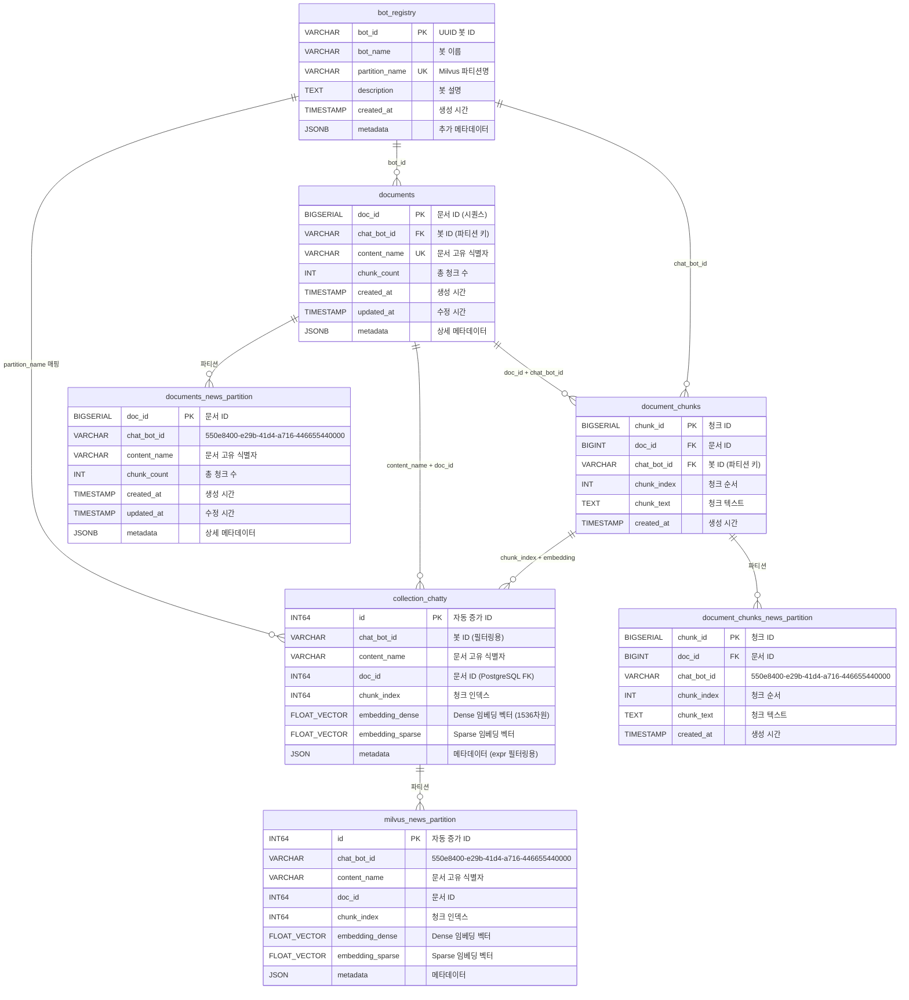
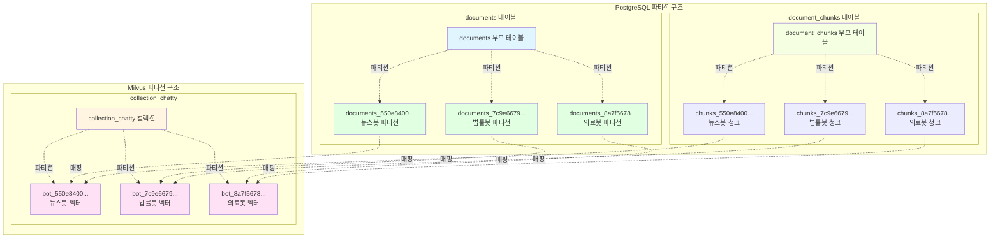
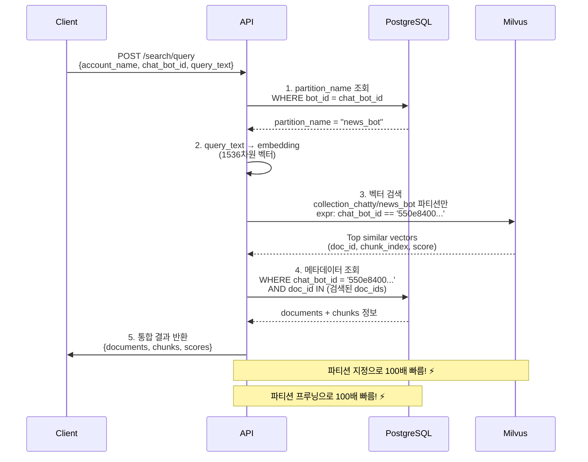
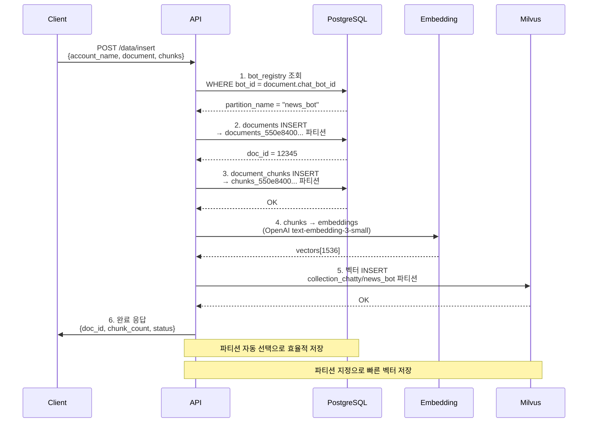
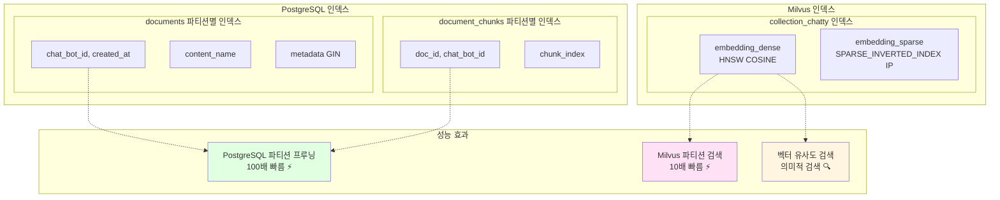
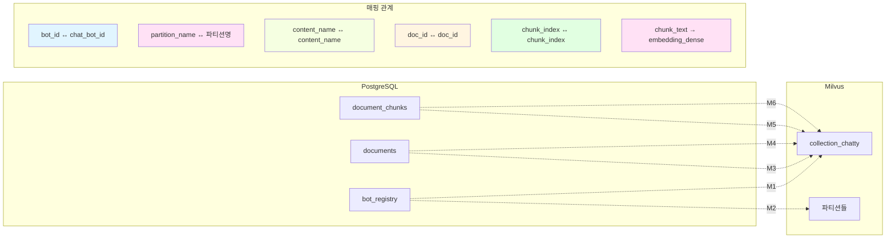

# 🗄️ Mermaid ERD: Milvus + PostgreSQL RAG 시스템

## 📊 전체 시스템 ERD

## 🎯 파티션 구조 다이어그램

## 🔍 검색 흐름 다이어그램

## 📥 삽입 흐름 다이어그램

## 🎯 인덱스 구조 다이어그램

## 📊 데이터 매핑 테이블

## ✅ 핵심 특징 요약

### 🚀 성능 최적화
- **파티션 프루닝**: 3억 건 → 300만 건처럼 빠르게
- **벡터 검색**: 파티션 지정으로 10배 빠름
- **인덱스 최적화**: HNSW, GIN 등 고성능 인덱스

### 🔗 완벽한 대칭 구조
- **PostgreSQL ↔ Milvus**: 1:1 매핑
- **파티션 구조**: 동일한 bot_id 기반
- **데이터 일관성**: content_name으로 문서 식별

### 📈 확장성
- **계정 레벨**: chatty → collection_chatty + rag_db_chatty
- **봇 레벨**: bot_id → 파티션 자동 생성
- **문서 레벨**: content_name으로 고유 식별

**완벽한 대칭 구조로 3억 건도 300만 건처럼 빠르게!** 🚀
